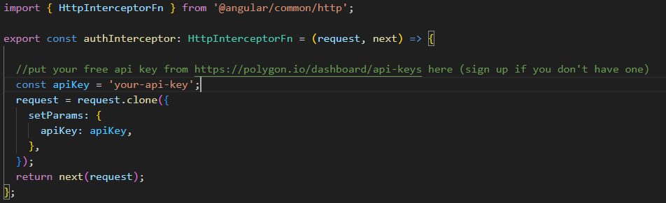

# EtfViewer

top manage your customized etf wallet and analyze the performance of your investments in one click with ETFViewer.

## setup your api Key

Put in `http.interceptor.ts` your FREE api key from `https://polygon.io/dashboard/api-keys` (sign up if you don't have one).

## Development server

Run `ng serve` for a dev server. Navigate to `http://localhost:4200/`. The application will automatically reload if you change any of the source files.
